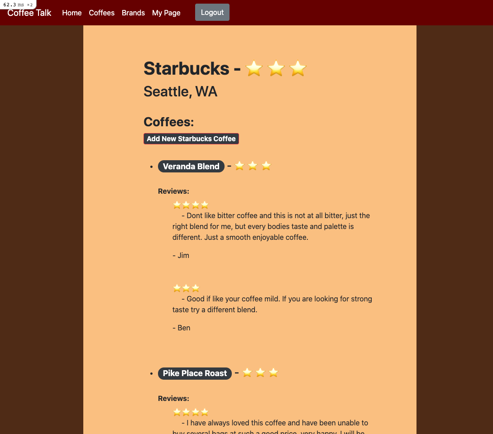

# Coffee Talk

Coffee Talk is a web based app where you can read and post reviews of coffee beans.

## Demo

[Video Walkthrough](https://drive.google.com/file/d/1MQtZyW62s8mWT__bhIQFIbvZNE7Twq0-/view?usp=sharing)

## Features
* Built with Ruby on Rails
* Implemented user signup and login with OAuth, and also with standard username/password credentials.
* Incorporates nested resource creation
* Follows RESTful conventions
* Full CRUD capabilities for resources

## To Install
1. Fork and clone this repository.
2. Run `bundle install` in your terminal.
3. Run `rails db:migrate` in your terminal
4. Run `rails s` to start app on rails server.
5. Navigate to http://localhost:3000

## Contributions
Any contributions are welcome. Please submit a pull request to do so.

## License
[MIT License](https://github.com/J5Wood/coffee-talk/blob/master/LICENSE.md)